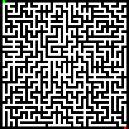

# Maze generator and solver

A simple maze generator and solver. There are two generation and solving algorithms. I limited the generation to the top left as the starting node and the bottom right as the end node.

Maze Generation algorithms:
* Iterative Backtracking
* Aldous Broder approach

Maze Solving algorithms:
* Depth first search
* Breadth first search

I created a `Maze` class that handles all of the generation. This class takes in two parameters that denote height and width by nodes, not the true length and width of the maze. The maze is made using a `Node` class that has its own x and y position and an array denoting the walls that exist or do not for the Node. If a wall exist that means there is no connection between the current node and the node in the direction of the wall. 

There are many ways to output the image of the maze. Using `Maze.simple_ascii` you can output is a text file; `Maze.display_maze` prints it out to the terminal; and `Maze.convert_to_image` creates two images where one of them is for image reading and the other is so that you can see the maze without zooming in too much.

## Maze Generation

### Iterative Backtracking

I learned this generation method from this [website](https://weblog.jamisbuck.org/2010/12/27/maze-generation-recursive-backtracking).

Using a simple backtracking method, the generation goes by moving to each node randomly adding the unvisited neighbors to a stack and removing the way between the current and next node, making the maze. When it hits a dead end, it will start to backtrack until it finds a nearby node that has been visited and continues its exploration until all nodes are visited. The reason I chose to do this iteratively was because I was originally afraid of doing it recursively but now realize that was stupid.

### Aldous Broder approach

I learned this generation method from this [website](https://weblog.jamisbuck.org/2011/1/17/maze-generation-aldous-broder-algorithm).

This approach is not an effective way to generate mazes but was an interesting one due to seeing how long it would take to finish creating a maze. This maze generation algorithm works very similar to the Iterative Backtracking except it does not retrace its steps to find unvisited nodes. Instead, it goes in random directions and already visited nodes to eventually find the final remaining nodes. The only merit for this method is that it creates more corridors and dead ends. I do not recommended to use this method to generate mazes.

## Maze Solving

### Breadth First Algorithm

Both algorithms implemented are very popular and useful for solving graph problems. The way that this algorithm works is by continually searching for the optimal but by doing it in "waves" or in "levels". When it finds a branch where there are two ways to go, the algorithm will queue up both spots and work on each of them at the same time. The algorithm prioritizes older nodes to make sure that its path gets solved at some point. If the path it took ends up being a dead end, then it will go to the other nodes in the queue until it reaches the end or runs out of spots to go.

### Depth First Algorithm

Instead of finding the solution using "waves", the Depth First algorithm solves the maze by continually going through nodes until it reaches a dead end or if it finds the exit/end node. Before the algorithm makes its choice in where to go, it saves all of the directions it can in a stack. Like the Bread First algorithm, if the path it took ends up being a dead end, then it will go to the other nodes in the stack until it reaches the end or runs out of spots to go.

